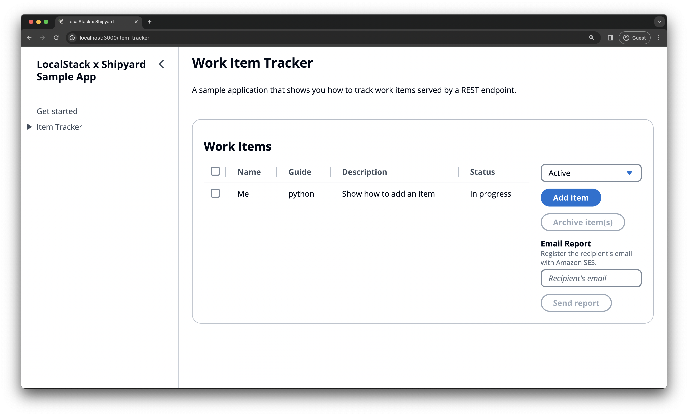

# Item Tracker application with LocalStack & Shipyard

| Key          | Value                                                                              |
| ------------ | ---------------------------------------------------------------------------------- |
| Environment  | LocalStack, AWS                                                                    |
| Services     | SES, DynamoDB                                                                      |
| Integrations | Shipyard, AWS CLI, CDK                                                             |
| Categories   | Web Application                                                                    |
| Level        | Basic                                                                              |
| GitHub       | [Repository link](https://github.com/HarshCasper/localstack-shipyard-item-tracker) |

## Introduction

This application demonstrates how to build a simple item tracker application using React & Flask with LocalStack provisioning AWS resources, such as DynamoDB and SES. The application uses Shipyard to create [ephemeral environments](https://docs.shipyard.build/docs/) for each pull request, and it uses Docker Compose to deploy the application services.

This application uses the AWS SDK for Python (Boto3) to establish a REST service, while performing the following actions:

- Develop a Flask-based REST service that seamlessly integrates with a React client & AWS services.
- Manage operations such as reading, writing, and updating work items stored in an DynamoDB table.
- Send email reports containing work item details using Simple Email Service (SES) from the React client.

## Prerequisites

- LocalStack with the [`localstack` CLI](https://docs.localstack.cloud/getting-started/installation/#localstack-cli).
- [AWS CLI](https://docs.localstack.cloud/user-guide/integrations/aws-cli/) with the [`awslocal` wrapper](https://docs.localstack.cloud/user-guide/integrations/aws-cli/#localstack-aws-cli-awslocal).
- [Node.js](https://nodejs.org/en/) with the `npm` package manager.
- [Python](https://www.python.org/downloads/) with `pip` in the `PATH`
- [Docker](https://docs.docker.com/get-docker/) with [`docker-compose`](https://docs.docker.com/compose/install/) installed.
- Optional:
    - [Cloud Development Kit (CDK)](https://docs.aws.amazon.com/cdk/latest/guide/getting_started.html) installed with the [`cdklocal` wrapper](https://docs.localstack.cloud/user-guide/integrations/aws-cdk/).

Start LocalStack on your local machine using the following command:

```shell
DEBUG=1 localstack start
```

## Running the application locally

You can run the application locally using `docker-compose`. The `docker-compose.yml` file contains the configuration for the Flask REST service, the React client, and the LocalStack services. Run the following command to start the application:

```shell
docker-compose up
```

The below sections provide the manual steps to create the AWS resources and start the Flask REST service and React client.

### Create a DynamoDB table

You can use LocalStack to create a local DynamoDB table. Run the following command to create a table named `doc-example-work-item-tracker`:

```shell
awslocal dynamodb create-table \
    --table-name doc-example-work-item-tracker \
    --attribute-definitions AttributeName=iditem,AttributeType=S \
    --key-schema AttributeName=iditem,KeyType=HASH \
    --provisioned-throughput ReadCapacityUnits=5,WriteCapacityUnits=5
```

In addition, we need to verify an email identity to send emails using SES. Run the following command to verify an email identity:

```shell
awslocal ses verify-email-identity --email hello@example.com
```

You can run the following command to list the email identities:

```shell
awslocal ses list-identities
```

### Start the Flask REST service

Before starting the Flask REST service, install the required Python packages using the following command:

```shell
cd backend
virtualenv .venv
source .venv/bin/activate # macOS/Linux; use .venv\Scripts\activate on Windows
pip install -r requirements.txt
```

You can start the Flask REST service using the following command in the `backend` directory:

```shell
python app.py
```

The backend service will start on `http://localhost:8080`. To test the service, you can use the following `curl` command:

```shell
curl -X POST http://localhost:8080/api/items \
-H "Content-Type: application/json" \
-d '{"name":"Me","guide":"python","description":"Show how to add an item","status":"In progress","archived":false}'
```

### Start the React client

Before starting the React client, install the required Node.js packages using the following command:

```shell
cd frontend
npm install
```

You can start the React client using the following command in the `frontend` directory:

```shell
npm start
```

The following command will start the React client on `http://localhost:3000/item_tracker`. You can use the client to add, update, and delete work items.



## Running the application with Shipyard

WIP

## Learn more

The application is based on a [public AWS tutorial](https://docs.aws.amazon.com/amazondynamodb/latest/developerguide/example_cross_DynamoDBDataTracker_section.html).
